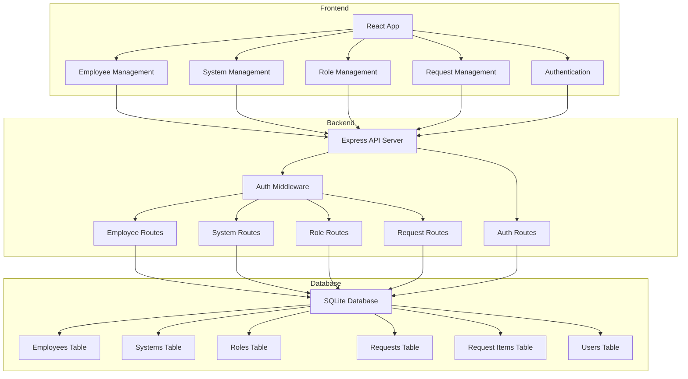
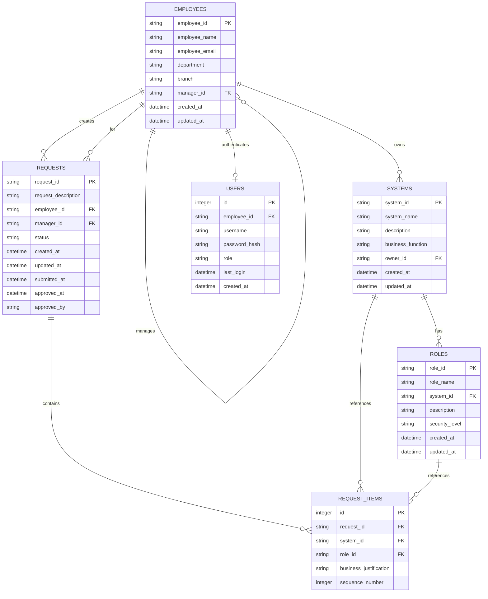
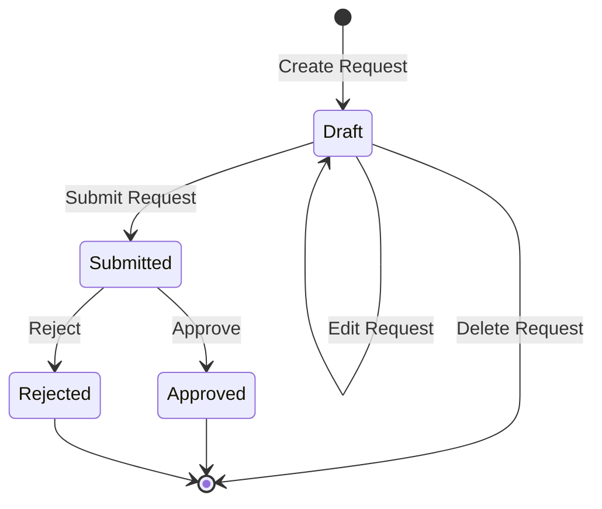

# System Access Request Application - Technical Plan

## Overview
A full-stack web application for managing system access requests where managers can request multiple system accesses for employees in a single request.

## Technology Stack
- **Frontend**: React.js with React Router
- **Backend**: Node.js with Express.js
- **Database**: SQLite3
- **Authentication**: JWT (JSON Web Tokens)
- **Styling**: CSS3 (or CSS framework like Tailwind/Bootstrap)

## Architecture



## Database Schema

### Tables Structure



### Table Definitions

#### EMPLOYEES
- `employee_id` (TEXT, PRIMARY KEY) - Unique employee identifier
- `employee_name` (TEXT, NOT NULL) - Full name
- `employee_email` (TEXT, NOT NULL, UNIQUE) - Email address
- `department` (TEXT, NOT NULL) - Department name
- `branch` (TEXT, NOT NULL) - Branch location
- `manager_id` (TEXT, FOREIGN KEY) - References employee_id
- `created_at` (DATETIME) - Record creation timestamp
- `updated_at` (DATETIME) - Last update timestamp

#### SYSTEMS
- `system_id` (TEXT, PRIMARY KEY) - Unique system identifier
- `system_name` (TEXT, NOT NULL, UNIQUE) - System name
- `description` (TEXT) - System description
- `business_function` (TEXT) - Business function served
- `owner_id` (TEXT, FOREIGN KEY) - References employee_id
- `created_at` (DATETIME) - Record creation timestamp
- `updated_at` (DATETIME) - Last update timestamp

#### ROLES
- `role_id` (TEXT, PRIMARY KEY) - Unique role identifier
- `role_name` (TEXT, NOT NULL) - Role name
- `system_id` (TEXT, FOREIGN KEY) - References system_id
- `description` (TEXT) - Role description
- `security_level` (TEXT) - Security level (e.g., Read, Write, Admin)
- `created_at` (DATETIME) - Record creation timestamp
- `updated_at` (DATETIME) - Last update timestamp
- UNIQUE constraint on (role_name, system_id)

#### REQUESTS
- `request_id` (TEXT, PRIMARY KEY) - Unique request identifier
- `request_description` (TEXT) - Overall request description
- `employee_id` (TEXT, FOREIGN KEY) - Employee requesting access
- `manager_id` (TEXT, FOREIGN KEY) - Manager creating request
- `status` (TEXT, NOT NULL) - Draft, Submitted, Approved, Rejected
- `created_at` (DATETIME) - Record creation timestamp
- `updated_at` (DATETIME) - Last update timestamp
- `submitted_at` (DATETIME) - Submission timestamp
- `approved_at` (DATETIME) - Approval/rejection timestamp
- `approved_by` (TEXT) - Approver employee_id

#### REQUEST_ITEMS
- `id` (INTEGER, PRIMARY KEY AUTOINCREMENT) - Auto-generated ID
- `request_id` (TEXT, FOREIGN KEY) - References request_id
- `system_id` (TEXT, FOREIGN KEY) - System being requested
- `role_id` (TEXT, FOREIGN KEY) - Role being requested
- `business_justification` (TEXT, NOT NULL) - Justification for access
- `sequence_number` (INTEGER) - Order of items in request

#### USERS
- `id` (INTEGER, PRIMARY KEY AUTOINCREMENT) - Auto-generated ID
- `employee_id` (TEXT, FOREIGN KEY, UNIQUE) - References employee_id
- `username` (TEXT, NOT NULL, UNIQUE) - Login username
- `password_hash` (TEXT, NOT NULL) - Hashed password
- `role` (TEXT) - User role (Manager, Admin, etc.)
- `last_login` (DATETIME) - Last login timestamp
- `created_at` (DATETIME) - Record creation timestamp

## API Endpoints

### Authentication
- `POST /api/auth/login` - User login
- `POST /api/auth/logout` - User logout
- `GET /api/auth/me` - Get current user info

### Employees
- `GET /api/employees` - List all employees
- `GET /api/employees/:id` - Get employee by ID
- `POST /api/employees` - Create new employee
- `PUT /api/employees/:id` - Update employee
- `DELETE /api/employees/:id` - Delete employee
- `GET /api/employees/:id/subordinates` - Get employees managed by this employee

### Systems
- `GET /api/systems` - List all systems
- `GET /api/systems/:id` - Get system by ID
- `POST /api/systems` - Create new system
- `PUT /api/systems/:id` - Update system
- `DELETE /api/systems/:id` - Delete system

### Roles
- `GET /api/roles` - List all roles
- `GET /api/roles/:id` - Get role by ID
- `GET /api/roles/system/:systemId` - Get roles for a system
- `POST /api/roles` - Create new role
- `PUT /api/roles/:id` - Update role
- `DELETE /api/roles/:id` - Delete role

### Requests
- `GET /api/requests` - List all requests (filtered by user role)
- `GET /api/requests/:id` - Get request by ID with items
- `POST /api/requests` - Create new request (Draft status)
- `PUT /api/requests/:id` - Update request (only if Draft)
- `DELETE /api/requests/:id` - Delete request (only if Draft)
- `POST /api/requests/:id/submit` - Submit request for approval
- `POST /api/requests/:id/approve` - Approve request
- `POST /api/requests/:id/reject` - Reject request

## Frontend Components Structure

### Pages
1. **Login Page** - Authentication
2. **Dashboard** - Overview and navigation
3. **Employee Management** - CRUD for employees
4. **System Management** - CRUD for systems
5. **Role Management** - CRUD for roles
6. **Request Management** - Create and manage requests
7. **Request List** - View all requests with filtering

### Key Components

#### Employee Form
- Employee ID input (validated for uniqueness)
- Name, email, department, branch inputs
- Manager selection dropdown (from employees list)
- Validation: required fields, email format, unique ID

#### System Form
- System ID input (validated for uniqueness)
- System name, description, business function inputs
- Owner selection dropdown (from employees list)
- Validation: required fields, unique ID and name

#### Role Form
- Role ID input (validated for uniqueness)
- Role name, description inputs
- System selection dropdown
- Security level selection (dropdown or radio)
- Validation: required fields, unique ID, unique role name per system

#### Request Form

**Section 1: Employee Selection**
- Employee dropdown (searchable)
- Auto-populated fields:
  - Employee Name (read-only)
  - Employee ID (read-only)
  - Department (read-only)
  - Branch (read-only)
  - Manager Name (read-only, from logged-in user)
  - Manager ID (read-only, from logged-in user)
- Request Description textarea

**Section 2: System Access Details**
- Dynamic rows for system/role selection
- Each row contains:
  - System dropdown (searchable)
  - Role dropdown (filtered by selected system)
  - Business Justification textarea (required)
  - Remove button (for rows after first)
- Add System button (adds new row)
- Row numbering/sequencing
- Validation: at least one system required, all fields in each row required

#### Request List Component
- Filterable table (by status, employee, date range)
- Columns: Request ID, Employee, Manager, Systems Count, Status, Created Date
- Actions: View, Edit (if Draft), Delete (if Draft), Submit, Approve/Reject
- Status badges with color coding

## Request Workflow



### Status Transitions
- **Draft**: Manager can edit/delete, not visible to approvers
- **Submitted**: Read-only, visible to approvers, awaiting decision
- **Approved**: Final state, access granted
- **Rejected**: Final state, access denied

## Validation Rules

### Employee
- `employee_id`: Required, unique, alphanumeric
- `employee_name`: Required, min 2 characters
- `employee_email`: Required, valid email format, unique
- `department`: Required
- `branch`: Required
- `manager_id`: Must exist in employees table (if provided)

### System
- `system_id`: Required, unique, alphanumeric
- `system_name`: Required, unique, min 2 characters
- `description`: Optional
- `business_function`: Required
- `owner_id`: Required, must exist in employees table

### Role
- `role_id`: Required, unique, alphanumeric
- `role_name`: Required, unique per system
- `system_id`: Required, must exist in systems table
- `description`: Optional
- `security_level`: Required, from predefined list

### Request
- `request_id`: Auto-generated, unique, format: REQ-YYYYMMDD-XXXX
- `request_description`: Required, min 10 characters
- `employee_id`: Required, must exist in employees table
- `manager_id`: Auto-filled from logged-in user
- At least one system/role combination required
- Each system/role must have business justification (min 20 characters)

## Security Considerations

1. **Authentication**: JWT tokens with expiration
2. **Authorization**: Role-based access control
   - Managers can create requests for their subordinates
   - Admins can manage all entities
   - System owners can approve requests for their systems
3. **Input Validation**: Server-side validation for all inputs
4. **SQL Injection Prevention**: Parameterized queries
5. **Password Security**: Bcrypt hashing with salt
6. **CORS**: Configured for frontend domain only

## Project Structure

```
systemrequest/
├── backend/
│   ├── src/
│   │   ├── config/
│   │   │   └── database.js
│   │   ├── middleware/
│   │   │   ├── auth.js
│   │   │   └── validation.js
│   │   ├── models/
│   │   │   ├── Employee.js
│   │   │   ├── System.js
│   │   │   ├── Role.js
│   │   │   ├── Request.js
│   │   │   └── User.js
│   │   ├── routes/
│   │   │   ├── auth.js
│   │   │   ├── employees.js
│   │   │   ├── systems.js
│   │   │   ├── roles.js
│   │   │   └── requests.js
│   │   ├── controllers/
│   │   │   ├── authController.js
│   │   │   ├── employeeController.js
│   │   │   ├── systemController.js
│   │   │   ├── roleController.js
│   │   │   └── requestController.js
│   │   ├── utils/
│   │   │   ├── validators.js
│   │   │   └── helpers.js
│   │   └── server.js
│   ├── package.json
│   └── .env
├── frontend/
│   ├── public/
│   │   └── index.html
│   ├── src/
│   │   ├── components/
│   │   │   ├── common/
│   │   │   │   ├── Navbar.jsx
│   │   │   │   ├── Sidebar.jsx
│   │   │   │   └── LoadingSpinner.jsx
│   │   │   ├── employees/
│   │   │   │   ├── EmployeeList.jsx
│   │   │   │   ├── EmployeeForm.jsx
│   │   │   │   └── EmployeeDetails.jsx
│   │   │   ├── systems/
│   │   │   │   ├── SystemList.jsx
│   │   │   │   ├── SystemForm.jsx
│   │   │   │   └── SystemDetails.jsx
│   │   │   ├── roles/
│   │   │   │   ├── RoleList.jsx
│   │   │   │   ├── RoleForm.jsx
│   │   │   │   └── RoleDetails.jsx
│   │   │   └── requests/
│   │   │       ├── RequestList.jsx
│   │   │       ├── RequestForm.jsx
│   │   │       ├── RequestDetails.jsx
│   │   │       └── SystemRoleRow.jsx
│   │   ├── pages/
│   │   │   ├── Login.jsx
│   │   │   ├── Dashboard.jsx
│   │   │   ├── Employees.jsx
│   │   │   ├── Systems.jsx
│   │   │   ├── Roles.jsx
│   │   │   └── Requests.jsx
│   │   ├── services/
│   │   │   ├── api.js
│   │   │   ├── authService.js
│   │   │   ├── employeeService.js
│   │   │   ├── systemService.js
│   │   │   ├── roleService.js
│   │   │   └── requestService.js
│   │   ├── context/
│   │   │   └── AuthContext.jsx
│   │   ├── utils/
│   │   │   ├── validators.js
│   │   │   └── helpers.js
│   │   ├── App.jsx
│   │   ├── App.css
│   │   └── index.js
│   ├── package.json
│   └── .env
├── database/
│   └── systemrequest.db (auto-generated)
└── README.md
```

## Implementation Phases

### Phase 1: Project Setup & Database
1. Initialize Node.js backend with Express
2. Initialize React frontend with Create React App
3. Set up SQLite database with schema
4. Create database initialization script
5. Set up environment variables

### Phase 2: Backend API Development
1. Implement authentication system
2. Create Employee CRUD endpoints
3. Create System CRUD endpoints
4. Create Role CRUD endpoints
5. Create Request CRUD endpoints with workflow
6. Add validation middleware
7. Add error handling

### Phase 3: Frontend Core Components
1. Set up routing with React Router
2. Create authentication context and login page
3. Build navigation and layout components
4. Create reusable form components
5. Set up API service layer

### Phase 4: Entity Management Interfaces
1. Build Employee management interface
2. Build System management interface
3. Build Role management interface
4. Add form validations
5. Add error handling and user feedback

### Phase 5: Request Management
1. Build Request form Section 1 (employee selection)
2. Build Request form Section 2 (dynamic system/role rows)
3. Implement request listing with filters
4. Add request details view
5. Implement status workflow actions
6. Add request validation

### Phase 6: Testing & Refinement
1. Test all CRUD operations
2. Test request workflow
3. Test validations and error handling
4. Test authentication and authorization
5. Fix bugs and refine UI/UX

## Key Features Summary

✅ Full CRUD operations for Employee, System, and Role entities
✅ Unique ID validation across all entities
✅ Manager can select employee and auto-populate related fields
✅ Dynamic system/role selection with multiple rows
✅ Business justification required for each system
✅ Request status workflow (Draft → Submitted → Approved/Rejected)
✅ Authentication with login/logout
✅ Data persistence in SQLite database
✅ Form validation and error handling
✅ Responsive user interface

## Next Steps

Once you approve this plan, we can switch to Code mode to begin implementation. The development will follow the phases outlined above, starting with project setup and database initialization.